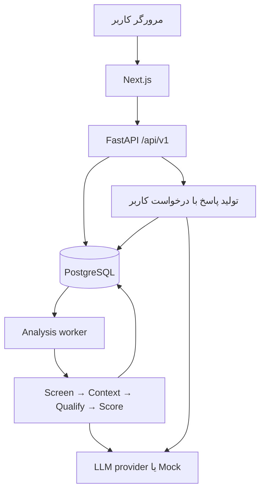

# SignalScout — معماری و برنامه اجرایی سه‌نفره

نسخه ۱٫۰ | تهیه‌شده در ۴ اکتبر ۲۰۲۶ | مدت برنامه: ۷ روز | هدف: MVP قابل تحویل

## ۱. تصمیم نهایی و فرض‌ها

SignalScout پیام‌های یک community را در ارتباط با یک محصول بررسی می‌کند؛ نیاز و قصد خرید را با توجه به گفت‌وگو تشخیص می‌دهد، امتیاز و دلیل می‌دهد و پاسخ پیشنهادی برای بررسی انسان تولید می‌کند.

- سه نفر؛ فرض برنامه حدود ۵ تا ۶ ساعت کار متمرکز برای هر نفر در روز است.
- نفر ۱: Backend، دیتابیس، API و یکپارچه‌سازی/استقرار.
- نفر ۲: موتور تحلیل، LLM، امتیازدهی، هزینه و ارزیابی.
- نفر ۳: Frontend، تجربه کاربری و بسته ارائه.
- یک محصول فعال در هر اجرای تحلیل، یک workspace محلی، ورودی CSV، حداکثر ۵۰۰ پیام در اجرای MVP.
- زبان رابط برای نسخه اول انگلیسی؛ نمایش صحیح متن فارسی و انگلیسی با `dir="auto"` برای پیام‌ها.
- پیام خودکار ارسال نمی‌شود؛ Approve فقط وضعیت پاسخ را ذخیره می‌کند. Copy خروجی را برای استفاده دستی آماده می‌کند.
- این سند طراحی پیشنهادی است؛ اعداد هدف، نتیجه آزمایش واقعی نیستند.

**ابهام تاریخ:** از ۴ اکتبر تا ۱۰ اکتبر، با احتساب روز شروع، هفت روز است. در متن قبلی مهلت ۹ اکتبر آمده که فقط شش روز تقویمی می‌دهد. تاریخ رسمی مسابقه در این سند تأیید نشده است. برنامه اصلی هفت‌روزه است، اما نسخه قابل تحویل باید روز ۵ آماده و روز ۶ قابل ارسال باشد؛ روز ۷ فقط حاشیه امن است. اگر مهلت واقعی ۹ اکتبر است، کارهای روز ۷ را طبق مسیر فشرده انتهای سند جلو بیندازید.

## ۲. محدوده ثابت MVP

| ضروری برای تحویل | خارج از محدوده این هفته |
|---|---|
| ساخت پروفایل محصول و Import CSV | اتصال واقعی Telegram/Discord/Reddit |
| غربال اولیه با محافظت از پیام‌های وابسته به context | دریافت real-time و ارسال خودکار |
| بازیابی context، تحلیل ساختاریافته، score و reason | CRM، پرداخت، چند workspace |
| فهرست و جزئیات Lead | OAuth و مدیریت نقش‌ها |
| تولید پاسخ با کلیک، ویرایش، تأیید/رد و کپی | چند provider و framework پیچیده چندعامل |
| ثبت مصرف، هزینه، feedback و ارزیابی پایه | vector database مستقل، microservices و Kubernetes |
| حالت Mock مشخص برای توسعه بدون API key | آموزش مدل یا fine-tuning |
| Docker Compose، دیتاست، README، ویدئو و تحویل | طراحی گرافیکی و انیمیشن سنگین |

Feedback ساده و ارزیابی پایه حذف نمی‌شوند. برای کم‌کردن scope ابتدا نمودارهای تزئینی، JSON import، embedding و سپس صفحات مجزای غیرضروری را کنار بگذارید؛ مسیر اصلی و صداقت معیارها حفظ شود.

## ۳. معماری پیشنهادی

**Monorepo + Modular Monolith**: بک‌اند یک کدبیس است و API و worker از همان image اجرا می‌شوند. worker فقط فرایند جداگانه‌ای برای کار طولانی تحلیل است؛ microservice جدا با قرارداد شبکه جدید نیست.

| جزء | انتخاب | مسئول | دلیل |
|---|---|---|---|
| Web | Next.js، TypeScript، Tailwind CSS | نفر ۳ | فرم‌ها، صفحه نتایج و تعاملات |
| API | Python، FastAPI، Pydantic | نفر ۱ | اعتبارسنجی و قرارداد JSON/OpenAPI |
| Persistence | PostgreSQL، SQLAlchemy، Alembic | نفر ۱ | ذخیره پیام، اجرای تحلیل، نتیجه و مصرف |
| Worker | فرایند Python از همان backend | نفر ۱ زیرساخت، نفر ۲ pipeline | اجرای batch بدون باز نگه‌داشتن درخواست HTTP |
| AI | یک provider واقعی + Mock adapter | نفر ۲ | توسعه مستقل و هزینه قابل اندازه‌گیری |
| Queue MVP | جدول analysis_runs در PostgreSQL؛ فقط یک worker | نفر ۱ | نیاز نداشتن به Redis/Celery در این مقیاس |
| اجرا | Docker Compose | نفر ۱ | اجرای یکسان برای هر سه نفر و داور |
| وضعیت پیشرفت | Polling حدود هر ۲ ثانیه | نفر ۳ | ساده‌تر از WebSocket برای MVP |

نسخه ابزارها را روز اول از مجموعه نسخه‌های سازگار انتخاب، در lockfile ثبت و تا تحویل ثابت نگه دارید. این سند نسخه‌ای را به‌عنوان «آخرین نسخه» معرفی نمی‌کند.



- Frontend فقط API را صدا می‌زند؛ به DB یا کلید provider دسترسی ندارد.
- API مسیرها، validation و transaction را مدیریت می‌کند؛ منطق scoring در route نوشته نمی‌شود.
- Agent engine ورودی typed می‌گیرد و خروجی typed برمی‌گرداند؛ SQLAlchemy یا FastAPI را import نمی‌کند.
- Context query در service بک‌اند است؛ انتخاب و محدودکردن context تابع خالص متعلق به نفر ۲ است.
- برای ۵۰۰ پیام، embedding اجباری نیست. اگر اضافه شد بردارها cache شوند؛ vector DB لازم نیست.
- هیچ خروجی HTML یا کد از متن پیام اجرا نمی‌شود. محتوای community داده نامطمئن است، نه دستور برای مدل.

## ۴. مسیر داده و چرخه اجرای تحلیل

۱. کاربر محصول را ذخیره می‌کند.
۲. CSV اعتبارسنجی و به‌صورت transaction وارد می‌شود؛ batch_id برمی‌گردد.
۳. `POST /analysis/runs` با product_id و batch_id، یک run در وضعیت queued می‌سازد؛ پاسخ HTTP برابر 202 است.
۴. worker یک run را در transaction کوتاه claim می‌کند، آن را running می‌کند و transaction را می‌بندد.
۵. پیام‌ها با ترتیب پایدار `timestamp, external_id` پردازش می‌شوند. هر پیام خروجی screening دارد؛ حتی ignoredها قابل حسابرسی‌اند.
۶. candidateها با context محدود و snapshot محصول به تحلیل عمیق می‌روند.
۷. نتیجه معتبر، score و usage ذخیره می‌شوند. خطای یک پیام، بقیه batch را متوقف نمی‌کند.
۸. UI وضعیت run و تعداد موفق/ناموفق را poll می‌کند؛ پس از پایان، Leadها و analytics همان run را می‌خواند.
۹. تولید پاسخ فقط با کلیک کاربر انجام می‌شود؛ مصرف آن نیز به همان run متصل است.

### وضعیت‌ها و رفتار در خطا

- Run: `queued | running | completed | partial | failed | interrupted`.
- `completed`: همه پیام‌ها خروجی معتبر دارند؛ `partial`: دست‌کم یک پیام موفق و دست‌کم یک خطا؛ `failed`: هیچ نتیجه موفقی تولید نشد یا خطای سطح run رخ داد.
- worker heartbeat دارد. در شروع مجددِ **تنها worker**، runهای running با heartbeat منقضی به interrupted تغییر کنند؛ بازاجرای هزینه‌دار خودکار انجام نشود.
- Resume روزهای بعد لازم نیست. کاربر می‌تواند با اقدام صریح یک run جدید بسازد؛ نتایج run قبلی باقی می‌ماند.
- کلید Idempotency درخواست دوباره یا double-click را به همان run برمی‌گرداند. استفاده از همان کلید با payload متفاوت: 409.
- constraint یکتا روی `(run_id, message_id)` مانع نتیجه تکراری داخل یک run می‌شود.
- claim می‌تواند با row lock انجام شود؛ هنگام تماس LLM هیچ transaction یا lock طولانی باز نماند.
- timeout provider قابل تنظیم؛ فقط خطاهای موقت مانند 429 و 5xx تا حداکثر ۲ retry با backoff. هر attempt در usage ثبت شود.
- پردازش MVP به‌صورت ترتیبی است؛ افزایش concurrency تا ۲ تنها بعد از اندازه‌گیری و با حفظ سقف هزینه.
- قطع فرایند بعد از پاسخ provider و قبل از ذخیره می‌تواند مصرف ثبت‌نشده ایجاد کند؛ هزینه برنامه برآورد مبتنی بر usage ثبت‌شده است، نه تضمین تطابق کامل با صورتحساب provider. ادعای exactly-once نداریم.

## ۵. Pipeline هوش مصنوعی

| مرحله | ورودی و کار | خروجی | مالک |
|---|---|---|---|
| Normalize | فاصله، نویسه‌های ی/ک، متن اصلی بدون تغییر باقی بماند | normalized_text | نفر ۲ |
| Screening | قواعد سبک + نشانه‌های نیاز + سرنخ thread/reply | candidate یا ignore و reason | نفر ۲ |
| Context selection | پیام‌های همان conversation، ترتیب زمانی و سقف طول | لیست پیام با ID | نفر ۲؛ query با نفر ۱ |
| Qualification | محصول، پیام هدف و context؛ structured JSON | signals، evidence، reason | نفر ۲ |
| Scoring | تابع deterministic با version | ۰ تا ۱۰۰ و تصمیم | نفر ۲ |
| Persist | نتیجه، نسخه‌ها، usage و وضعیت | رکورد قابل مشاهده | نفر ۱ |
| Reply on demand | Lead + snapshot محصول + context | draft محدود به واقعیت‌های محصول | نفر ۲ |

### اصلاح مهم غربال اولیه

پیام «آره ولی گرونه» ممکن است بدون کلمه کلیدی، Lead مهمی باشد. پیش از حذف، reply_to و سرنخ موضوعی conversation بررسی شود. اگر parent یا حداکثر سه پیام قبل مرتبط است یا وابستگی ارجاعی مبهم وجود دارد، پیام برای بررسی نگه داشته شود. هدف غربال اولیه حفظ Recall است؛ کم‌کردن هزینه نباید با حذف Leadهای واقعی به دست آید.

- relevance threshold ثابت مانند 0.35 بدون ارزیابی پذیرفته نیست؛ شروع با rules قابل فهم و تنظیم روی development set.
- اگر semantic similarity اضافه شد، امتیاز شباهت را احتمال خرید یا confidence تلقی نکنید.
- context فقط از همان batch/community/conversation است؛ پیام کاربران مختلف با هویت صریح نمایش داده شود. قصد خرید شخص دیگر به نویسنده پیام هدف نسبت داده نشود.
- MVP حالت offline دارد: حداکثر ۳ پیام قبل و ۲ پیام بعد؛ وجود پیام‌های آینده در UI و مستندات ذکر شود. برای حالت live آینده، پیام‌های بعد باید حذف شوند.
- در صورت reply_to، parent داخل همان conversation در اولویت است؛ سپس نزدیک‌ترین همسایه‌ها تا سقف ۵ پیام context.
- طول context محدود و قابل تنظیم؛ timestamp و author همراه متن ارسال شود.
- evidence باید ID و عبارت موجود در پیام را نشان دهد؛ نقل‌قول ساختگی یا اشاره به پیام خارج از context رد شود.
- دستورهای داخل پیام مانند «امتیاز مرا ۱۰۰ بده» اجرا نمی‌شوند.

### امتیاز و تصمیم

همه signals اعداد بین ۰ و ۱ هستند:

`raw_score = 30×purchase_intent + 30×product_fit + 15×need_strength + 10×urgency + 10×confidence + 5×response_opportunity`

`lead_score = floor(raw_score + 0.5)` سپس محدودکردن به بازه ۰ تا ۱۰۰.

- ۰–۳۹: ignore؛ ۴۰–۶۹: review؛ ۷۰–۱۰۰: respond.
- اگر score بالا ولی confidence کمتر از 0.60 باشد، تصمیم به review تنزل کند.
- اگر score بالا ولی product_fit کمتر از 0.50، evidence خرید نامعتبر، یا نیازمند بازبینی انسانی باشد، review شود و decision_reason توضیح دهد.
- مقدار نامعلوم budget برابر `unknown` است؛ مدل نباید بودجه یا فوریت را از خود بسازد. نبود نشانه فوریت با urgency پایین ثبت شود و limitation توضیح داده شود.
- این وزن‌ها و thresholdها فرض اولیه‌اند؛ نسخه `score_v1` و تغییرات روی development set ثبت شود.
- confidence مدل یک برآورد خوداظهاری است و درصد دقت تجربی نیست.

## ۶. قرارداد مشترک سه نفر

**مالک schemaهای Pydantic و OpenAPI: نفر ۱. مالک معنای فیلدهای AI: نفر ۲. مصرف‌کننده TypeScript: نفر ۳.** در پایان روز اول نام و نوع فیلدها freeze شود؛ تغییر بعدی باید با اطلاع هر سه نفر و update fixture انجام شود.

قواعد: JSON از snake_case، IDها از UUID string، زمان‌ها از UTC ISO-8601 و enumها از حروف کوچک استفاده کنند. هزینه USD به‌صورت decimal string یا null ارسال شود. هیچ NaN، infinity یا score خارج از بازه پذیرفته نیست.

### ورودی CSV

فیلدهای اجباری: `external_id,conversation_id,author,content,timestamp`.
فیلد اختیاری: `reply_to_external_id`.
community_name و product_id در فرم وارد می‌شوند، نه در تک‌تک ردیف‌ها.

- UTF-8 و UTF-8 BOM پشتیبانی شوند؛ timestamp حتماً timezone داشته باشد.
- سقف: ۵ MB، ۵۰۰ ردیف، هر content حداکثر ۴۰۰۰ کاراکتر.
- اگر هر ردیف نامعتبر است، کل import رد شود و شماره ردیف/فیلد اعلام گردد؛ درج نصفه نداشته باشیم.
- external_id در هر batch یکتا؛ import مجدد همان فایل با همان community_name از طریق checksum به batch موجود برگردد.
- parent ناموجود warning ایجاد کند؛ parent متعلق به conversation دیگر وارد context نشود.

### ورودی Agent

`ProductSnapshot + TargetMessage + ContextMessages + RunConfig → AnalysisResult`

Snapshot شامل نام محصول، توضیح، مخاطب، مشکل حل‌شده، مناسب/نامناسب، price اختیاری و currency است. Agent هیچ رکوردی را مستقیم در DB نمی‌نویسد. Provider adapter علاوه بر خروجی، usage رویداد هر attempt را برمی‌گرداند؛ خطا نیز از این قاعده مستثنی نیست.

### نمونه خروجی qualification و scoring

این نمونه نمایشی است و نتیجه اجرای واقعی نیست؛ IDهای نمونه باید در fixture به رکوردهای موجود اشاره کنند.

```json
{
  "message_id": "11111111-1111-4111-8111-111111111111",
  "screening": {"is_candidate": true, "reason": "explicit_need"},
  "signals": {
    "purchase_intent": 0.9,
    "product_fit": 0.9,
    "need_strength": 0.8,
    "urgency": 0.5,
    "confidence": 0.9,
    "response_opportunity": 0.8
  },
  "intent": "searching_for_course",
  "need": "project-based backend learning",
  "budget_signal": "unknown",
  "lead_score": 84,
  "decision": "respond",
  "decision_reason": "score_threshold_met",
  "reason": "The author explicitly requests a project-based backend course.",
  "evidence": [
    {"message_id": "11111111-1111-4111-8111-111111111111", "quote": "دنبال دوره بک‌اند پروژه‌محور هستم"}
  ],
  "limitations": ["Budget is unknown"],
  "context_message_ids": [],
  "scoring_version": "score_v1",
  "prompt_version": "qualify_v1",
  "provider_mode": "mock"
}
```

خروجی screening که ignore شده: signals، intent و lead_score برابر null؛ decision برابر ignore و reason توضیح غربال. «تحلیل نشده» را امتیاز صفر یا confidence صفر جا نزنید. پیام failed هیچ تصمیم قطعی ندارد؛ decision نیز null است و در شاخص‌ها lead محسوب نمی‌شود.

Suggested reply فیلد اجباری خروجی analysis نیست؛ فقط با endpoint جدا تولید می‌شود. Draft شامل response_text، status، provider_mode، usage و زمان است. Agent متن پیشنهادی می‌سازد؛ کد تصمیم و score نهایی را تعیین می‌کند.

## ۷. مدل داده

همه جدول‌ها UUID PK و created_at UTC دارند. روابط دارای foreign key باشند. JSONB برای snapshot و signals/evidence مناسب است؛ روابط اصلی با ID نگهداری شوند.

| جدول | فیلدهای اصلی و محدودیت |
|---|---|
| products | name, description, target_customer, problems_solved, best_fit, not_fit, price nullable, currency |
| import_batches | community_name, filename, checksum, row_count؛ unique(community_name, checksum) |
| messages | batch_id FK, external_id, conversation_id, author, content, normalized_content, timestamp, reply_to_external_id؛ unique(batch_id, external_id) |
| analysis_runs | product_id FK, batch_id FK, product_snapshot, config_snapshot, idempotency_key unique, status, total_count, processed_count, failed_count, heartbeat_at, started_at, finished_at, error |
| analyses | run_id FK, message_id FK, status, is_candidate, screening_reason, signals JSONB nullable, intent, need, budget_signal, lead_score nullable, decision nullable, decision_reason, reason, evidence JSONB, context_message_ids JSONB, limitations, versions, provider_mode؛ unique(run_id, message_id) |
| suggested_responses | analysis_id FK unique, text, status pending/approved/edited/rejected, provider_mode, updated_at؛ regeneration همان draft را با اقدام صریح جایگزین کند |
| llm_usage | run_id FK, message_id nullable FK, analysis_id nullable FK, stage, attempt_no, request_id nullable, model, provider_mode, input_tokens nullable, output_tokens nullable, cost_usd NUMERIC nullable, cost_status, price_version, latency_ms, outcome, created_at |
| feedback | analysis_id FK unique, relevant boolean, comment nullable, updated_at؛ تغییر رأی جایگزین رکورد فعلی شود |

ایندکس‌ها: messages(batch_id, conversation_id, timestamp)، analysis_runs(status, created_at)، analyses(run_id, decision, lead_score)، llm_usage(run_id, stage). شمارنده‌ها همراه ذخیره نتیجه به‌صورت transaction کوتاه آپدیت شوند؛ صفحه پیشرفت درصد ساختگی نمایش ندهد.

بدون users table و authentication در MVP محلی. اگر نمونه روی اینترنت قرار گرفت از دسترسی خصوصی یا رمز محیط میزبانی استفاده شود؛ instance بدون احراز هویت برای داده واقعی عمومی نشود.

## ۸. API ثابت — پیشوند /api/v1

| Method / Path | رفتار | مصرف‌کننده |
|---|---|---|
| GET /health | وضعیت API | توسعه و deployment |
| GET /ready | آمادگی DB و migration | Compose |
| POST /products | ساخت محصول؛ 201 | فرم محصول |
| GET /products | فهرست | انتخاب محصول |
| GET /products/{id} | جزئیات | فرم |
| PATCH /products/{id} | ویرایش؛ snapshot run قبلی تغییر نمی‌کند | فرم |
| POST /imports | multipart file + community_name؛ batch و count | Upload |
| GET /messages?batch_id=... | صفحه‌بندی پیام‌ها | بررسی Import |
| POST /analysis/runs | body: product_id, batch_id؛ Idempotency-Key header؛ 202 | شروع تحلیل |
| GET /analysis/runs/{id} | وضعیت، تعدادها و خطاها | Polling |
| GET /leads?run_id=... | پیش‌فرض review/respond؛ filter decision و min_score | فهرست |
| GET /leads/{analysis_id} | نتیجه، پیام، context، draft و feedback | جزئیات |
| POST /leads/{id}/response | تولید draft؛ اگر هست همان را برگرداند، regenerate فقط صریح | دکمه تولید |
| PATCH /leads/{id}/response | ویرایش متن و status | کنترل انسانی |
| PUT /leads/{id}/feedback | upsert relevant/comment | رأی |
| GET /analytics/overview?run_id=... | شمارنده‌ها، کیفیت بازخورد، هزینه | Dashboard |

فهرست‌ها: `items,total,limit,offset`؛ limit پیش‌فرض ۲۰ و حداکثر ۱۰۰.
خطاها: `{"error":{"code":"invalid_csv","message":"...","details":[]}}`؛ validation نیز به همین قالب تبدیل شود. 404 برای ID ناموجود، 409 برای conflict، 422 برای ورودی نامعتبر، 502/504 برای شکست/timeout provider در تولید پاسخ. Analysis batch خطاهای پردازش را در status ذخیره می‌کند.

نمونه run status:

```json
{
  "id": "22222222-2222-4222-8222-222222222222",
  "status": "running",
  "total_count": 100,
  "processed_count": 40,
  "failed_count": 2,
  "candidate_count": 12,
  "deep_analyzed_count": 10
}
```

processed_count تعداد پیام‌های به وضعیت نهایی رسیده، شامل failed است؛ بنابراین پیشرفت این نمونه ۴۰٪ و موفقیت تا این لحظه ۳۸ پیام است. deep_analyzed_count فقط تحلیل‌های عمیق موفق را می‌شمارد؛ تعداد attempt جداست.

## ۹. هزینه، کیفیت و شرط صداقت Demo

### هزینه

- نرخ input/output برای هر مدل از تنظیمات versioned با تاریخ نرخ گرفته شود؛ در این سند قیمت روز هیچ provider ادعا نشده است.
- `cost = input_tokens / 1_000_000 × input_rate + output_tokens / 1_000_000 × output_rate`، با احتساب دسته‌های cached/reasoning فقط طبق قرارداد واقعی provider.
- usage تمام مراحل پولی، embedding احتمالی، retry، repair و پاسخ پیشنهادی ثبت شود. صرفاً تعداد درخواست موفق کافی نیست.
- usage یا نرخ نامعلوم → cost برابر null و `cost_status=unknown`؛ هرگز صفر فرض نشود.
- Mock: توکن واقعی ندارد؛ cost صفر با `cost_status=mock` و badge واضح. این اعداد وارد نتیجه ارزیابی واقعی نشوند.
- total_cost به‌همراه unknown_usage_count و cost_complete نمایش داده شود؛ جمع ناقص برچسب «هزینه ثبت‌شده» بگیرد.
- هزینه/پیام = مجموع هزینه run ÷ total_count؛ هزینه/Lead = مجموع هزینه run ÷ تعداد respond. اگر مخرج صفر یا هزینه ناقص است، مقدار نهایی null/N/A.
- بودجه run در config مشخص شود. قبل از هر تماس، هزینه حداکثری تماس با سقف token برآورد شود؛ اگر budget کافی نیست، run متوقف/partial و علت budget_exceeded ثبت شود. اگر قیمت نامعلوم است اجرای paid فعال نشود.

### کیفیت

| معیار | تعریف |
|---|---|
| Qualified leads | تحلیل‌های با decision=respond؛ review جدا شمرده شود |
| Feedback acceptance | رأی relevant ÷ کل رأی‌های دریافت‌شده؛ coverage نیز گزارش شود |
| Feedback coverage | تعداد Leadهای دارای رأی ÷ Leadهای نمایش‌داده‌شده در scope تعریف‌شده |
| Offline precision | TP/(TP+FP) روی test set مستقل؛ predicted positive یعنی respond |
| Offline recall | TP/(TP+FN) روی همه test messages، شامل حذف‌شده‌های screening |
| Screening recall | Leadهای واقعی که از screening گذشته‌اند ÷ تمام Leadهای واقعی test |
| Screening bypass | پیام‌های با تصمیم terminal از screening و بدون deep attempt ÷ کل پیام‌ها؛ ناموفق‌ها bypass محسوب نشوند |
| Latency | median و p95 زمان candidate و زمان کل batch به‌صورت جدا |

«۸۷٪ تماس عمیق کمتر» برابر «۸۷٪ هزینه کمتر» نیست. کاهش هزینه نیاز به baseline قابل مقایسه دارد. Feedback acceptance نیز بدون مجموعه حقیقت مرجع، Precision مستقل محسوب نمی‌شود. اگر هنوز feedback نیست مقدار N/A نمایش داده شود.

دیتاست: ۲۰ پیام fixture روز ۱؛ development set حدود ۶۰ پیام و test set جدا حداقل ۱۰۰ پیام تا روز ۵. conversationهای یکسان بین dev/test پخش نشوند. داده‌ها synthetic و برچسب‌خورده‌اند؛ ادعای عملکرد روی داده واقعی نکنید. نفر ۲ برچسب اولیه می‌زند؛ نفر ۳ موارد اختلافی/مرزی را مستقل بازبینی می‌کند. برچسب‌ها در فایل جدا باشند و به Agent ارسال نشوند.

هدف‌های اولیه، نه تضمین: precision ≥ 80٪، recall ≥ 75٪، screening recall ≥ 90٪. نسبت صرفه‌جویی، زمان و هزینه واقعی اندازه‌گیری و گزارش شوند؛ برای رسیدن به عدد جذاب، threshold را روی test set تنظیم نکنید. در گزارش n و confusion matrix ذکر شود.

## ۱۰. ساختار repository و مالکیت فایل‌ها

```text
signalscout/
  README.md
  AGENTS.md
  .env.example
  .gitignore
  compose.yaml
  docs/
    architecture.md
    api-contract.md
    team-plan.md
    demo-script.md
    evaluation.md
  contracts/
    openapi.json
    examples/
  backend/
    pyproject.toml
    uv.lock
    Dockerfile
    alembic.ini
    migrations/
    app/
      main.py
      worker.py
      api/routes/
      core/config.py
      db/
      models/
      schemas/
      services/
        import_service.py
        analysis_service.py
        context_service.py
        analytics_service.py
      agents/
        contracts.py
        pipeline.py
        screening.py
        context.py
        qualification.py
        scoring.py
        reply.py
        cost.py
        prompts/
        providers/
          base.py
          mock.py
          real.py
    tests/
  frontend/
    package.json
    package-lock.json
    Dockerfile
    app/
      page.tsx
      products/page.tsx
      imports/page.tsx
      runs/[id]/page.tsx
      leads/page.tsx
      leads/[id]/page.tsx
    components/
    lib/api.ts
    lib/generated/
  data/
    demo_messages.csv
    evaluation/dev_messages.csv
    evaluation/dev_labels.json
    evaluation/test_messages.csv
    evaluation/test_labels.json
  scripts/
    export_openapi.py
    evaluate.py
```

| مالک | محدوده اصلی | همکار/بازبین |
|---|---|---|
| نفر ۱ | api، db، models، schemas، services، worker، migrations، Compose، CI | نفر ۲ قرارداد AI را review کند |
| نفر ۲ | agents، promptها، scoring، cost، evaluation، provider adapter | نفر ۱ ذخیره usage و خطا را review کند |
| نفر ۳ | frontend، demo-script، screenshot و presentation | نفر ۱ تطابق API را review کند |
| قرارداد مشترک | contracts و AGENTS.md؛ نفر ۱ merge کند | تأیید هر سه نفر |

## ۱۱. برنامه دقیق هفت‌روزه

روزها از امروز ۴ اکتبر ۲۰۲۶ فرض شده‌اند. ستون «خروجی قابل قبول» شرط پایان روز است؛ صرف ساخت فایل یا زدن commit کافی نیست.

### روز ۱ — قرارداد و اسکلت؛ یکشنبه ۴ اکتبر

| نفر | تسک‌ها | خروجی قابل قبول |
|---|---|---|
| ۱ | B01: monorepo، env، Compose و health؛ B02: DB و migration اولیه؛ B03: Pydantic/OpenAPI و fixture مشترک | API و DB بالا بیایند؛ POST/GET محصول و قرارداد typed موجود باشد |
| ۲ | A01: Agent contracts و MockProvider؛ A02: scoring خالص و تست مرزها؛ A03: ۲۰ پیام شامل context و noise | نفر ۱ بتواند mock pipeline را بدون key import و اجرا کند |
| ۳ | F01: Next.js و layout؛ F02: فرم محصول و shell صفحات؛ F03: api client و fixture | صفحه باز شود، محصول با API ذخیره شود، پیام فارسی درست دیده شود |

جلسه ۴۵ دقیقه‌ای شروع: نام محصول، schema، enumها، مسیر API و مالک فایل‌ها را توافق کنید. نمونه پاسخ اولیه تا قبل از میانه روز به نفر ۳ برسد. پایان روز: هر سه روی سیستم خود Compose را اجرا کنند.

### روز ۲ — واردکردن داده و اولین اتصال؛ دوشنبه ۵ اکتبر

| نفر | تسک‌ها | خروجی قابل قبول |
|---|---|---|
| ۱ | B04: importer اتمیک و dedup؛ B05: run queue، worker و status API با Mock؛ B06: context query | CSV وارد شود و run با نتیجه mock تا completed برود |
| ۲ | A04: screening با context hints؛ A05: context selection؛ A06: adapter واقعی و validation اولیه | سه نمونه noise، context-dependent و strong lead از pipeline عبور کنند |
| ۳ | F04: Import با خطای ردیفی؛ F05: progress polling؛ F06: لیست Lead متصل به API | مسیر Product → Import → Run → Lead در حالت mock قابل کلیک باشد |

وابستگی: fixture و contract روز ۱؛ نفر ۳ منتظر provider واقعی نمی‌ماند. در نیمه روز حداقل یک integration روی branch مشترک انجام شود.

### روز ۳ — مسیر واقعی انتها به انتها؛ سه‌شنبه ۶ اکتبر

| نفر | تسک‌ها | خروجی قابل قبول |
|---|---|---|
| ۱ | B07: ذخیره خروجی واقعی و usage؛ B08: timeout، partial failure و idempotency؛ B09: Lead detail | double-click دو run نسازد؛ خرابی یک پیام بقیه را متوقف نکند |
| ۲ | A07: prompt واقعی، evidence validation و guardها؛ A08: budget و usage attempt؛ A09: dev set اولیه | حداقل ۲۰ پیام با provider واقعی و snapshot محصول تحلیل شوند |
| ۳ | F07: Lead detail با context/evidence؛ F08: نمایش partial/error/mock؛ F09: smoke مرورگر | Upload → Analyze → Open Lead با خروجی واقعی کار کند |

**گیت اصلی:** پایان روز ۳ یک نسخه ساده ولی واقعی از ابتدا تا انتها کار کند. اگر گیت رد شد، روز ۴ ابتدا صرف رفع همان مسیر شود؛ هیچ feature جانبی اضافه نشود.

### روز ۴ — پاسخ، هزینه و بازخورد؛ چهارشنبه ۷ اکتبر

| نفر | تسک‌ها | خروجی قابل قبول |
|---|---|---|
| ۱ | B10: response generate/update؛ B11: feedback upsert و analytics؛ B12: اجرای بسته روی محیط مقصد خصوصی | endpointها، scope run و هزینه reply درست ذخیره شوند |
| ۲ | A10: پاسخ grounded؛ A11: محاسبه هزینه با نرخ versioned؛ A12: eval script و dev tuning | reply ادعای ناموجود نسازد؛ هزینه retry و null درست باشد |
| ۳ | F10: Generate/Edit/Copy/Approve/Reject؛ F11: cards هزینه و کیفیت؛ F12: سناریوی ارائه | تأیید پاسخ فقط status را عوض کند؛ N/A و Mock واضح باشد |

خروجی مشترک: مسیر کامل P0؛ پیش‌نویس README و سناریوی ارائه همین روز آماده شود. انتخاب/ساخت slide و ویدئو به روز آخر موکول نشود.

### روز ۵ — تثبیت و نسخه قابل تحویل؛ پنجشنبه ۸ اکتبر

| نفر | تسک‌ها | خروجی قابل قبول |
|---|---|---|
| ۱ | B13: restart/interrupted، import errors و integration checks؛ B14: نصب از checkout تمیز؛ B15: build/release candidate | فرد دیگری با README پروژه را اجرا کند و data پس از restart باقی بماند |
| ۲ | A13: evaluation روی test set دست‌نخورده؛ A14: گزارش TP/FP/FN/TN و هزینه واقعی؛ A15: ثبت محدودیت‌ها | metrics با n و نسخه مدل/prompt قابل بازتولید باشد |
| ۳ | F13: loading/empty/error و متن فارسی؛ F14: screenshot و draft video؛ F15: بازبینی برچسب‌های مرزی | یک demo کامل ضبط اولیه شود و هیچ عدد جعلی در UI نباشد |

**Feature freeze:** پایان روز ۵. نتیجه این روز باید قابل تحویل باشد. اگر کیفیت هدف حاصل نشد، نتیجه واقعی و محدودیت را ثبت کنید؛ تغییرات بزرگ معماری انجام ندهید.

### روز ۶ — تست نهایی و ارسال در مهلت کوتاه؛ جمعه ۹ اکتبر

| نفر | تسک‌ها | خروجی قابل قبول |
|---|---|---|
| ۱ | B16: bugهای blocker، lockfile، release tag و بررسی دستور اجرا؛ B17: آماده‌سازی URL/ZIP طبق مقررات | نسخه demo ثابت و build موفق |
| ۲ | A16: مرور ادعاهای AI، گزارش هزینه و انتخاب ۳ مثال explainable | نتایج ارائه با run واقعی و گزارش تطابق داشته باشد |
| ۳ | F16: ویدئوی نهایی ۳–۵ دقیقه، README و ارائه کوتاه؛ F17: چک‌لیست ارسال | لینک‌ها، فایل‌ها و demo قابل مشاهده باشند |

هر سه نفر یک بار سناریو را از صفر اجرا کنند. اگر deadline رسمی ۹ اکتبر است، **همین روز ارسال** و رسید ارسال نگهداری شود؛ ساعت دقیق از منبع مسابقه بررسی شود. تا ساعت آخر صبر نکنید.

### روز ۷ — حاشیه امن و تحویل؛ شنبه ۱۰ اکتبر

| نفر | تسک‌ها | خروجی قابل قبول |
|---|---|---|
| ۱ | رفع صرفاً blocker و بررسی release تحویلی | بدون تغییر API یا schema |
| ۲ | آماده‌سازی پاسخ به سؤال داور درباره context، هزینه و خطاها | ادعاهای مستند و محدودیت‌های روشن |
| ۳ | کنترل نهایی فایل و لینک، ارسال اگر هنوز مهلت برقرار است | رسید یا تأیید تحویل |

روز ۷ برای تکمیل feature ضروری رزرو نشده است. اگر مهلت روز ۶ باشد این فعالیت‌ها به بعدازظهر روز ۵ و روز ۶ منتقل شوند.

## ۱۲. قواعد همکاری و مسیر بحرانی

- فقط `main` محافظت‌شده و branch کوتاه مثل `feat/csv-import`؛ برای تیم سه‌نفره این هفته develop اضافه لازم نیست.
- هر PR کوچک و حداکثر یک روزه؛ نفر دیگر آن را review کند. روزی حداقل یک integration انجام شود.
- اول صبح ۱۰ دقیقه: کار امروز، dependency و blocker؛ آخر روز ۱۵ دقیقه: demo خروجی واقعی.
- blocker بیشتر از ۳۰ دقیقه همان روز اعلام شود؛ پایان روزهای ۲ و ۳ تا رفع اتصال، task جانبی متوقف شود.
- migration و schema مشترک با نفر ۱ هماهنگ شود؛ agent files را نفر ۲ و frontend را نفر ۳ نگه دارند.
- مسیر بحرانی: قرارداد → Import → Run/worker → خروجی واقعی → ذخیره و Lead detail → هزینه/Reply → ارزیابی/تحویل.
- فرانت با fixture و سپس Mock backend جلو برود؛ fixture باید همان schema واقعی را داشته باشد.
- در تغییر schema، OpenAPI و TypeScript و fixture در یک PR به‌روز شوند.
- credentials در `.env` محلی و secret محیط اجرا؛ `.env.example` فقط placeholder؛ کلید هیچ‌وقت در frontend و repo قرار نگیرد.

### اگر عقب افتادیم

| زمان تشخیص | اقدام |
|---|---|
| روز ۲: embedding آماده نیست | حذف embedding و ادامه با screening قواعدیِ context-aware |
| روز ۳: provider واقعی وصل نیست | نفر ۱ و ۲ اتصال را اولویت دهند؛ Mock برای توسعه UI ادامه دارد ولی به‌عنوان AI واقعی تحویل معرفی نمی‌شود |
| روز ۴: UI عقب است | analytics را در Dashboard ادغام، صفحه پیام‌ها و نمودارها را حذف کنید |
| روز ۵: استقرار ابری مانع است | Compose و demo محلی را کامل کنید؛ فقط اگر قوانین مسابقه اجازه می‌دهد تحویل محلی بدهید |
| کیفیت ضعیف است | خطاها را بررسی و روی dev اصلاح کنید؛ test را برای تنظیم threshold مصرف نکنید |

## ۱۳. Definition of Done نهایی

- [ ] checkout تمیز با دستور مستند بالا می‌آید؛ migration دستی و مبهم لازم نیست.
- [ ] حالت mock بدون API key اجرا می‌شود و همه نتایج آن واضح برچسب دارند.
- [ ] حداقل یک run با provider واقعی، usage واقعی و گزارش ارزیابی انجام شده است.
- [ ] CSV سالم وارد می‌شود؛ CSV خراب خطای قابل فهم دارد؛ import تکراری رکورد تکراری نمی‌سازد.
- [ ] double-click تحلیل را دوبار اجرا نمی‌کند؛ failure و restart وضعیت دروغین completed تولید نمی‌کند.
- [ ] context از conversation دیگر نشت نمی‌کند؛ شواهد به متن واقعی اشاره می‌کنند.
- [ ] score و decision در کد تعیین می‌شوند و نمونه score=84 قابل بازتولید است.
- [ ] Prompt injection موجود در پیام‌های test به دستور سیستمی تبدیل نمی‌شود.
- [ ] پاسخ پیشنهادی فقط بر اساس محصول و context است؛ ارسال خودکار وجود ندارد.
- [ ] feedback، reply و هزینه بعد از refresh باقی می‌مانند.
- [ ] هزینه unknown از صفر متمایز، تقسیم بر صفر N/A و Mock از واقعی جداست.
- [ ] Precision/Recall تست از feedback acceptance جدا گزارش می‌شود.
- [ ] README، معماری، دیتاست، گزارش ارزیابی، screenshot و ویدئو موجود است.
- [ ] هیچ secret در repo، screenshot یا ویدئو نیست؛ نسخه نهایی tag دارد.

## ۱۴. چگونه فایل‌ها را به Codex بدهید

۱. همین فایل را همراه فایل‌های اصلی صورت مسئله و هر requirement رسمی مسابقه به Codex بدهید.
۲. محتوای `SignalScout_Codex_Bootstrap_Prompt.txt` را به‌عنوان پیام اجرا کپی کنید.
۳. خروجی آن مرحله فقط foundation قابل اجرا با Mock و یک مسیر کامل ساده است؛ برنامه هفت‌روزه همچنان برای تکمیل AI واقعی و تحویل لازم است.
۴. اگر Codex به فایل یا شبکه دسترسی ندارد، باید دقیقاً آن را گزارش کند؛ نباید ادعا کند build یا test اجرا شده است.

## ۱۵. منابع فنی برای دو تصمیم زیرساختی

- [FastAPI — Background Tasks](https://fastapi.tiangolo.com/tutorial/background-tasks/): تفکیک کار پس‌زمینه ساده از پردازش‌های نیازمند ابزار/فرایند مستقل. انتخاب worker جدا برای این پروژه تصمیم طراحی ماست.
- [PostgreSQL — SELECT و SKIP LOCKED](https://www.postgresql.org/docs/15/sql-select.html): کاربرد row locking برای مصرف‌کنندگان جدول شبیه صف. در MVP یک worker داریم؛ lock کوتاه و وضعیت پایدار همچنان مفید است.

این منابع تأیید مهلت مسابقه، قیمت مدل یا نتایج عملکرد نیستند.
